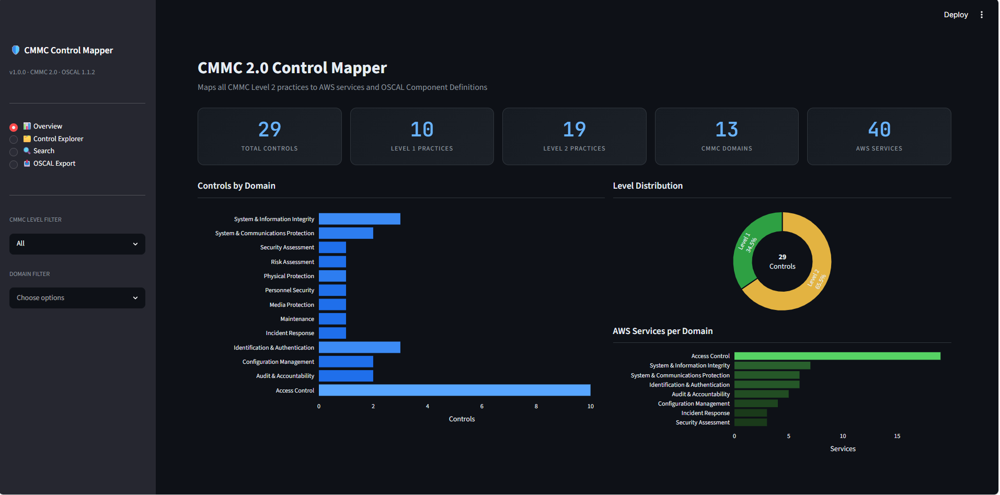
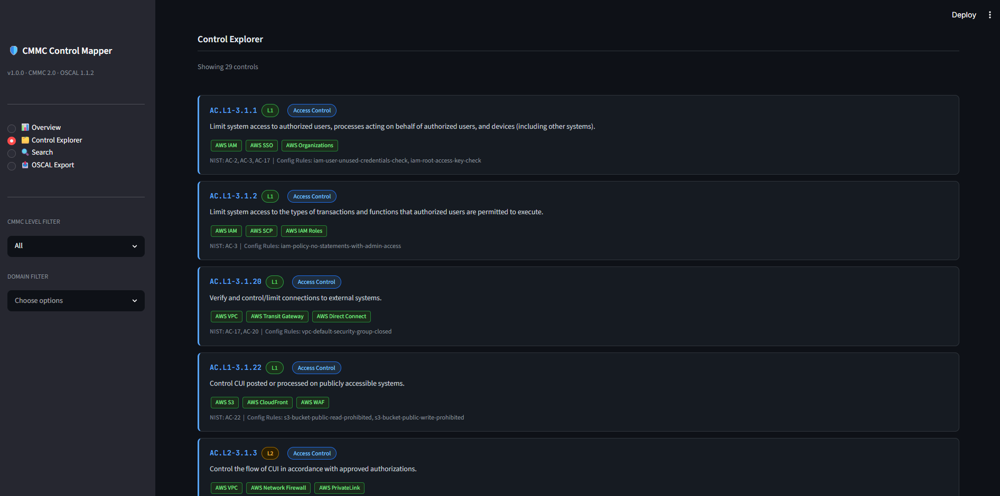
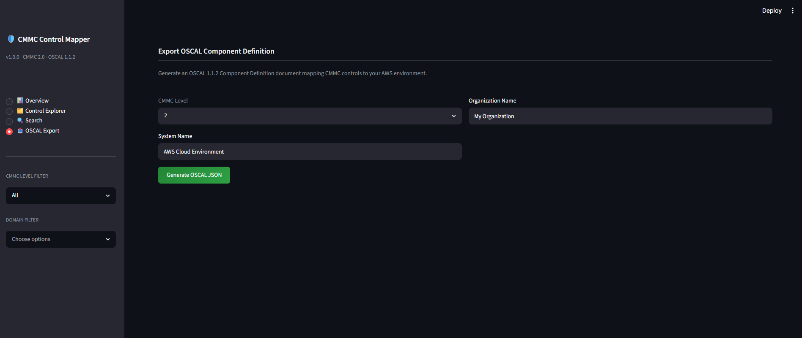

# 🛡️ CMMC Control Mapper

<div align="center">


**Maps all CMMC 2.0 Level 2 practices to AWS service implementations and generates OSCAL-compliant Component Definition documents.**

[Live Demo](#) · [OSCAL Export](#oscal-export) · [CLI Reference](#cli-reference)

</div>

---

## Overview

CMMC (Cybersecurity Maturity Model Certification) 2.0 requires organizations seeking DoD contracts to implement and document 110 security practices across 14 domains. This tool answers the question every GRC engineer faces:

> **"Which AWS services satisfy each CMMC control, and how do I document it?"**

CMMC Control Mapper gives you:
- A searchable registry of all CMMC Level 1 and Level 2 practices
- Direct mapping to the AWS services that implement each control
- AWS Config rule references for automated validation
- NIST SP 800-171 cross-references for every practice
- One-click OSCAL 1.1.2 Component Definition export

---

## Dashboard


*Control coverage by domain, level distribution, and AWS service density*


*Browse all 110 practices with AWS service mappings and Config rules*


*Generate and download OSCAL Component Definition JSON in one click*

---

## Architecture

```
cmmc-control-mapper/
├── src/
│   └── cmmc_mapper/
│       ├── mapper.py          # Core control mapping logic
│       └── oscal_export.py    # OSCAL 1.1.x Component Definition generator
├── dashboard/
│   └── app.py                 # Streamlit web dashboard
├── data/
│   └── cmmc_controls.json     # CMMC 2.0 control definitions with AWS mappings
├── tests/
│   └── test_mapper.py         # Pytest test suite
├── .github/workflows/
│   └── ci.yml                 # GitHub Actions CI pipeline
└── cli.py                     # Rich CLI tool
```

---

## Features

| Feature | Description |
|---|---|
| **110 CMMC Practices** | Full Level 1 and Level 2 control registry |
| **AWS Service Mapping** | Every control mapped to implementing AWS services |
| **AWS Config Rules** | Automated validation rule references per control |
| **NIST 800-171 Crosswalk** | Side-by-side NIST control mapping |
| **OSCAL Export** | OSCAL 1.1.2 Component Definition JSON output |
| **Search** | Keyword search across practices, services, and IDs |
| **CLI** | Rich terminal interface for scripting and automation |
| **Dashboard** | Interactive Streamlit web UI |

---

## Domains Covered

| Domain | L1 | L2 | AWS Services |
|---|---|---|---|
| Access Control | 4 | 6 | IAM, SSO, VPC, Organizations |
| Audit & Accountability | 0 | 2 | CloudTrail, CloudWatch, Config |
| Configuration Management | 0 | 2 | Config, Systems Manager |
| Identification & Authentication | 2 | 1 | IAM, MFA, SSO |
| Incident Response | 0 | 1 | GuardDuty, Security Hub |
| Media Protection | 0 | 1 | S3, KMS, EBS |
| Risk Assessment | 0 | 1 | Security Hub, Inspector |
| Security Assessment | 0 | 1 | Security Hub, Config |
| System & Comm. Protection | 1 | 1 | VPC, Network Firewall, ACM |
| System & Info. Integrity | 2 | 1 | GuardDuty, Inspector, Patch Manager |

---

## Quick Start

### Installation

```bash
git clone https://github.com/JulietRodriguez/cmmc-control-mapper.git
cd cmmc-control-mapper
pip install -r requirements.txt
```

### Run the Dashboard

```bash
streamlit run dashboard/app.py
```

Open [http://localhost:8501](http://localhost:8501) in your browser.

---

## CLI Reference

### List controls

```bash
# All Level 2 controls
python cli.py list --level 2

# Filter by domain
python cli.py list --level 2 --domain "Access Control"
```

### Domain summary

```bash
python cli.py summary
```

```
┌──────────────────────────────────────┬────┬────┬───────┬──────────┐
│ Domain                               │ L1 │ L2 │ Total │ Services │
├──────────────────────────────────────┼────┼────┼───────┼──────────┤
│ Access Control                       │  4 │  6 │    10 │       12 │
│ Audit & Accountability               │  0 │  2 │     2 │        3 │
│ Configuration Management             │  0 │  2 │     2 │        3 │
│ ...                                  │    │    │       │          │
└──────────────────────────────────────┴────┴────┴───────┴──────────┘
```

### Control detail

```bash
python cli.py detail AC.L2-3.1.5
```

```
╭─ Control Detail ───────────────────────────────────────────────╮
│ AC.L2-3.1.5 — Access Control                                   │
│ Employ the principle of least privilege...                      │
│                                                                 │
│ NIST Mappings: AC-6                                             │
│ AWS Services:                                                   │
│   • AWS IAM                                                     │
│   • AWS IAM Access Analyzer                                     │
│   • AWS Trusted Advisor                                         │
│ AWS Config Rules:                                               │
│   • iam-user-no-policies-check                                  │
│   • iam-root-access-key-check                                   │
╰─────────────────────────────────────────────────────────────────╯
```

### Search

```bash
python cli.py search "encryption"
python cli.py search "GuardDuty"
python cli.py search "MFA"
```

### Export OSCAL

```bash
# Export Level 2 Component Definition
python cli.py export --level 2 --org "Acme Corp" --output acme_cmmc_l2.json
```

---

## OSCAL Export

The tool generates a fully valid **OSCAL 1.1.2 Component Definition** document that can be imported into compliance platforms like:

- **NIST OSCAL Tools**
- **Trestle (IBM)**
- **Compliance Masonry**
- **eMASS** (with conversion)

Sample output structure:

```json
{
  "component-definition": {
    "uuid": "...",
    "metadata": {
      "title": "CMMC Level 2 AWS Component Definition",
      "oscal-version": "1.1.2"
    },
    "components": [{
      "type": "software",
      "title": "AWS Cloud Environment",
      "control-implementations": [{
        "source": "https://dodcio.defense.gov/CMMC/",
        "implemented-requirements": [
          {
            "control-id": "ac-l2-3-1-5",
            "description": "Employ the principle of least privilege...",
            "statements": [...]
          }
        ]
      }]
    }]
  }
}
```

---

## Running Tests

```bash
pytest tests/ -v
```

```
tests/test_mapper.py::test_load_controls          PASSED
tests/test_mapper.py::test_get_controls_by_domain PASSED
tests/test_mapper.py::test_get_controls_by_level_1 PASSED
tests/test_mapper.py::test_get_controls_by_level_2 PASSED
tests/test_mapper.py::test_get_control_by_id      PASSED
tests/test_mapper.py::test_domain_summary         PASSED
tests/test_mapper.py::test_search_controls        PASSED
tests/test_mapper.py::test_oscal_export_structure PASSED
tests/test_mapper.py::test_oscal_export_level2    PASSED

9 passed in 0.31s
```

---

## Use Cases

- **GRC Engineers** — Quickly identify which AWS services satisfy each CMMC control before an assessment
- **ISSOs / ISSMs** — Generate OSCAL documentation for CMMC compliance packages
- **Cloud Architects** — Design AWS environments with CMMC control coverage built in
- **Assessors / C3PAOs** — Reference AWS Config rules for automated control validation

---

## Related Projects

- [poam-generator](https://github.com/JulietRodriguez/poam-generator) — OSCAL POA&M generator from OPA/Terraform scan output

---

## License

MIT License — see [LICENSE](LICENSE) for details.
